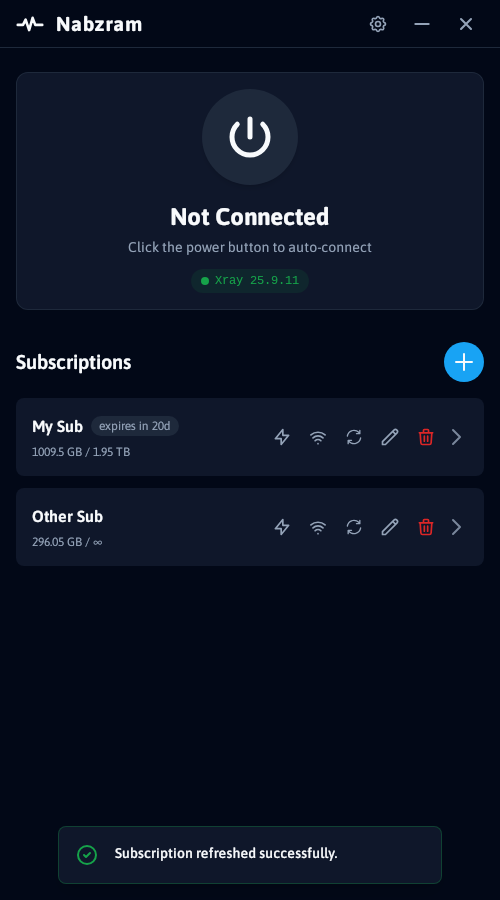
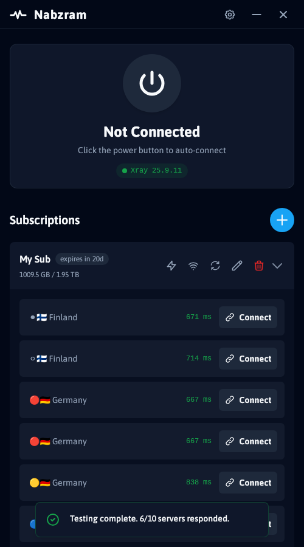
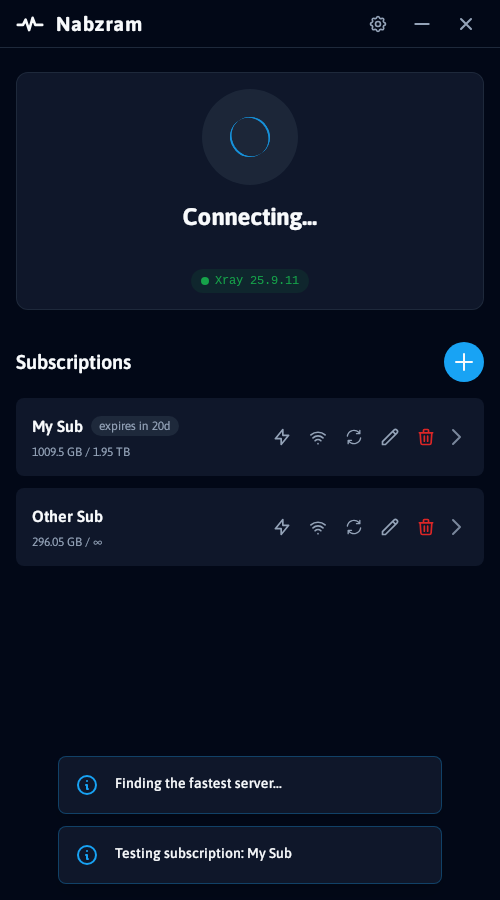
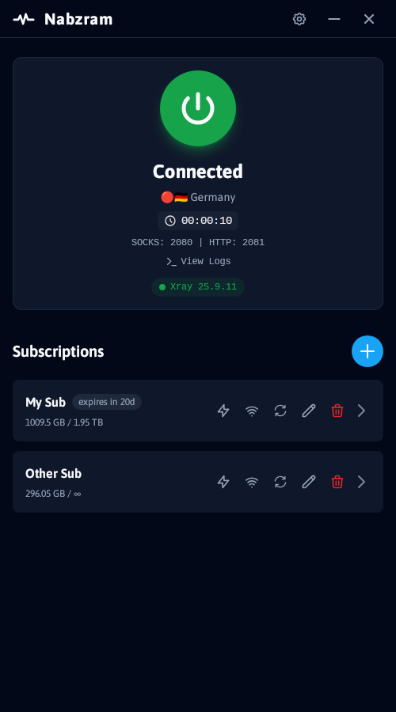
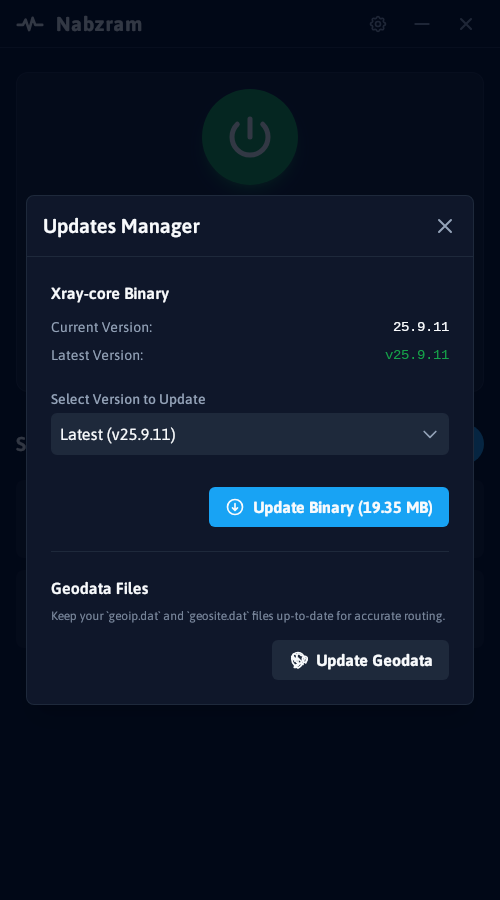
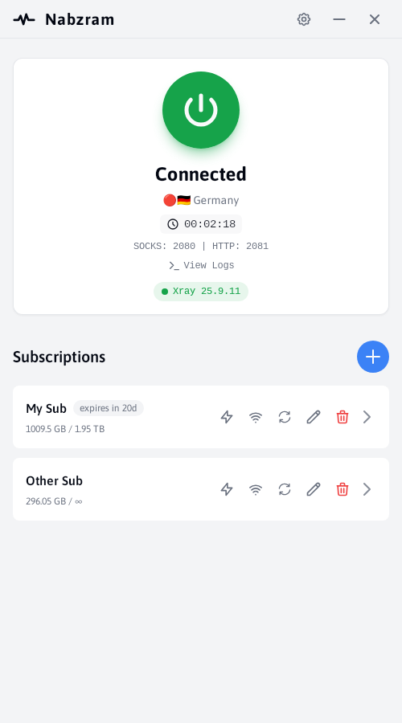

# Nabzram

<div align="center">
  
</div>

<div align="center">

*A Marzban subscription tool born out of pure boredom and built with whatever tech stack was lying around* 🤷🏻‍♂️

</div>

> **Fun Fact**: This entire project, including the logo, components, app architecture, and even this README you're reading right now, was crafted by AI. I was bored one day, had some VPN subscriptions to manage, and thought "why not?" So here we are - a desktop app that probably does more than it needs to, but hey, it works! 😮‍💨

A cool GUI application for adding and connecting to **Marzban subscription servers**. Built with Python FastAPI backend and React frontend, wrapped in a native desktop application using pywebview.

> **Important**: This app is made specifically for Marzban subscriptions. It runs Xray-core and exposes SOCKS/HTTP proxies to your system - **no TUN interface or system-wide proxy configuration** (for now).


## Download

**Ready to use**: Download the latest release from [GitHub Releases](https://github.com/amirho3inf/nabzram/releases)

No installation required - just run the executable!

## Features

- **📱 Mobile-First Design**: Clean, responsive UI optimized for mobile and desktop
- **🔗 Marzban Subscription Tool**: Add and connect to Marzban subscription servers
- **🌐 Multi-Server Support**: Connect to multiple servers from different subscriptions
- **⚡ Real-time Status**: Live connection status and server monitoring
- **📊 Traffic Monitoring**: View usage statistics and subscription limits
- **🔄 Auto-Updates**: Automatic Xray-core binary updates
- **📝 Log Streaming**: Real-time connection logs and debugging
- **🎨 Dark Theme**: Modern dark theme with customizable settings
- **🖥️ Cross-Platform**: Native desktop app supporting Windows, macOS, and Linux
- **🔧 System Tray**: Minimize to system tray with quick access

## Screenshots

<div style="overflow-x: auto; white-space: nowrap;">
  
  
  
  
  
  
</div>

## Build from Source

### Prerequisites

- **Python 3.12+**
- **Xray-core**: Optional - app will download it for you if not found
- **Node.js/Bun**: For frontend development (optional)

**Supported Platforms**: Windows, macOS, and Linux

### System Dependencies

#### Linux (Ubuntu/Debian)
```bash
sudo apt-get update
sudo apt-get install -y \
  pkg-config build-essential python3-dev \
  libcairo2-dev libgirepository1.0-dev \
  libgtk-3-dev libwebkit2gtk-4.1-dev
```

#### Windows
- No additional system dependencies required
- Xray-core will be automatically downloaded if not found

#### macOS
- No additional system dependencies required
- Xray-core will be automatically downloaded if not found

### Install Xray-core (Optional)

The app can automatically download Xray-core if not found, but you can also install it manually:

#### Linux
```bash
# Download and install Xray-core
bash <(curl -L https://github.com/XTLS/Xray-install/raw/main/install-release.sh)
```

#### Windows
- Download from [Xray releases](https://github.com/XTLS/Xray-core/releases)
- Or let Nabzram download it automatically

#### macOS
```bash
# Using Homebrew
brew install xray

# Or download manually from releases
```

**Note**: If Xray-core is not installed, the app will prompt you to download it automatically on first run.

### Python Installation

1. **Clone the repository**
   ```bash
   git clone https://github.com/amirho3inf/nabzram.git
   cd nabzram
   ```

2. **Install Python dependencies**
   ```bash
   pip install -r requirements.txt
   ```

3. **Run the application**
   ```bash
   python main.py
   ```

## Development

### Frontend Development

The frontend is built with React, TypeScript, and Vite:

```bash
cd ui
bun install
bun run dev
```

### Backend Development

The backend uses FastAPI and runs on a configurable port:

```bash
# Run on default random port (10000-65535)
python server.py

# Run on specific port
NABZRAM_API_PORT=8000 python server.py
```

**Note**: If `NABZRAM_API_PORT` is not set, the server will automatically find a random free port between 10000-65535.

### Building Executable

Build a standalone executable using Nuitka:

```bash
python build.py
```

This will create a single executable file in the `dist/` directory.

## Configuration

### Environment Variables

Copy `env.example` to `.env` and modify as needed:

```bash
cp env.example .env
```

Available options:
- `NABZRAM_DATABASE_PATH`: Database file location
- `NABZRAM_API_HOST`: API host (default: 0.0.0.0)
- `NABZRAM_API_PORT`: API port (default: 8000)
- `NABZRAM_CORS_ORIGINS`: CORS origins (default: *)

### Settings

Configure the application through the Settings modal:
- **Xray Binary Path**: Custom path to Xray executable
- **Assets Folder**: Xray assets directory
- **SOCKS Port**: Default SOCKS proxy port
- **HTTP Port**: Default HTTP proxy port

## Usage

### Adding Marzban Subscriptions

1. Click the **"+"** button to add a new subscription
2. Enter a name and your Marzban subscription URL (must support `/v2ray-json` endpoint)
3. The app will automatically fetch and parse server configurations
4. Servers will appear in the subscription list

### Connecting to Servers

1. Select a subscription to view its servers
2. Click on a server to connect
3. Monitor connection status and logs
4. Use the disconnect button to stop the connection

**Note**: Connections expose SOCKS and HTTP proxies to your system. You'll need to configure your applications to use these proxies manually - no system-wide proxy or TUN interface is configured.

### Managing Subscriptions

- **Update**: Refresh server list from subscription URL
- **Edit**: Modify subscription name or URL
- **Delete**: Remove subscription and all servers

## Architecture

### Backend (Python)
- **FastAPI**: REST API server
- **TinyDB**: Local database for subscriptions and settings
- **Xray-core**: Proxy protocol implementation
- **PyWebview**: Desktop application wrapper

### Frontend (React)
- **React 19**: UI framework
- **TypeScript**: Type safety
- **Vite**: Build tool and dev server
- **Tailwind CSS**: Styling (via CDN)

### Key Components

```
app/
├── api/routes/          # API endpoints
├── core/               # Core configuration
├── database/           # Database management
├── models/             # Data models
└── services/           # Business logic

ui/
├── components/         # React components
├── contexts/           # React contexts
├── services/           # API client
└── types.ts           # TypeScript definitions
```

## API Endpoints

- `GET /subscriptions` - List all subscriptions
- `POST /subscriptions` - Create new subscription
- `GET /subscriptions/{id}` - Get subscription details
- `PUT /subscriptions/{id}` - Update subscription
- `DELETE /subscriptions/{id}` - Delete subscription
- `POST /subscriptions/{id}/update` - Update servers
- `GET /servers` - List all servers
- `POST /servers/{id}/start` - Start server
- `POST /servers/{id}/stop` - Stop server
- `GET /logs/{id}` - Get server logs
- `GET /settings` - Get application settings
- `PUT /settings` - Update settings
- `GET /updates/xray/info` - Get Xray version info
- `POST /updates/xray/update` - Update Xray binary

## Supported Protocols

- **VMess**: V2Ray protocol
- **VLESS**: V2Ray protocol variant
- **Trojan**: Trojan protocol
- **Shadowsocks**: Shadowsocks protocol
- **HTTP/HTTPS**: HTTP proxy
- **SOCKS**: SOCKS proxy

## Troubleshooting

### Xray Not Found
- Ensure Xray-core is installed and in PATH
- Check the binary path in Settings
- Let the app download Xray automatically

### Connection Issues
- Verify subscription URL is accessible
- Check server configuration validity
- Review connection logs for errors

### GUI Issues
- Restart the application
- Check system dependencies (Linux)
- Verify WebKit installation

## Contributing

1. Fork the repository
2. Create a feature branch
3. Make your changes
4. Add tests if applicable
5. Submit a pull request

## License

This project is licensed under the GNU General Public License v3.0 (GPL-3.0). See the [LICENSE](LICENSE) file for full terms.

- No warranty is provided, express or implied (see Sections 15–16).
- If you distribute modified versions, you must release the source code under GPL-3.0.
- Please include attribution by mentioning that your project is a fork of `Nabzram` and link back to this repository.

## Acknowledgments

- [Xray-core](https://github.com/XTLS/Xray-core) - Proxy protocol implementation
- [FastAPI](https://fastapi.tiangolo.com/) - Web framework
- [React](https://reactjs.org/) - UI library
- [PyWebview](https://github.com/r0x0r/pywebview) - Desktop wrapper

## Support

- **Issues**: [GitHub Issues](https://github.com/your-username/Marzban-GUI/issues)
- **Discussions**: [GitHub Discussions](https://github.com/your-username/Marzban-GUI/discussions)
- **Documentation**: [Wiki](https://github.com/your-username/Marzban-GUI/wiki)

---

**Note**: This application is for educational and personal use only. Please ensure compliance with local laws and regulations regarding VPN usage.
